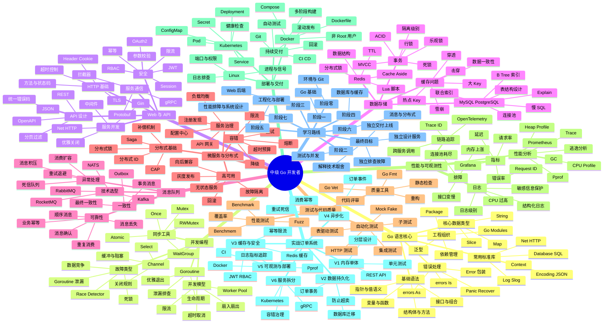

# 中级 Go 能力思维导图

```mermaid
mindmap
  root((中级 Go 开发者))
    Go 语言核心
      基础语法
        变量与函数
        指针与值语义
        结构体与方法
        接口与组合
      核心数据类型
        Slice
        Map
        String
      错误处理
        Error 包装
        errors Is
        errors As
        Panic Recover
      工程组织
        Package
        Go Modules
        依赖管理
        泛型
      常用标准库
        Context
        Net HTTP
        Database SQL
        Encoding JSON
        Log Slog

    并发编程
      Goroutine
        生命周期
        泄漏排查
        优雅退出
      Channel
        缓冲与阻塞
        Select
        关闭规则
      同步工具
        Mutex
        RWMutex
        WaitGroup
        Once
        Atomic
      并发模型
        Worker Pool
        扇入扇出
        限流
        超时取消
      故障类型
        数据竞争
        死锁
        Goroutine 泄漏
        Race Detector

    Web 与 API
      HTTP 基础
        方法与状态码
        Header Cookie
        TLS
        超时控制
      服务开发
        Net HTTP
        Gin
        中间件
        优雅关闭
      API 设计
        REST
        JSON
        分页过滤
        统一错误码
        OpenAPI
      服务通信
        gRPC
        Protobuf
        拦截器
      安全
        参数校验
        JWT
        Session
        RBAC
        OAuth2
        限流
        幂等

    数据存储
      MySQL PostgreSQL
        表结构设计
        B Tree 索引
        联合索引
        Explain
        慢 SQL
        连接池
      事务
        ACID
        隔离级别
        MVCC
        行锁
        死锁
        乐观锁
      Redis
        数据结构
        TTL
        Cache Aside
        分布式锁
        Lua 脚本
      缓存问题
        穿透
        击穿
        雪崩
        热点 Key
        大 Key
        数据一致性

    消息队列
      技术选型
        Kafka
        RabbitMQ
        RocketMQ
        NATS
      可靠性
        消息确认
        重复消费
        业务幂等
        顺序消息
        消息丢失
      异常处理
        重试退避
        死信队列
        消息积压
        消费扩容
      一致性
        事务消息
        Outbox
        最终一致性

    微服务与分布式
      服务治理
        注册发现
        配置中心
        负载均衡
        API 网关
      容错
        超时预算
        重试
        熔断
        降级
        限流
      分布式基础
        CAP
        分布式 ID
        分布式锁
        Saga
        补偿机制
      高可用
        无状态服务
        故障隔离
        灰度发布
        向后兼容
        回滚

    测试与代码质量
      自动化测试
        表驱动测试
        子测试
        HTTP 测试
        集成测试
        Mock Fake
      性能测试
        Benchmark
        Benchmem
        Fuzz
        覆盖率
      质量工具
        Go Fmt
        Go Vet
        静态检查
        代码评审
        重构

    性能与可观测性
      性能分析
        Pprof
        Trace
        逃逸分析
        GC
        CPU Profile
        Heap Profile
      日志
        结构化日志
        Request ID
        日志级别
        敏感信息保护
      指标
        Prometheus
        Grafana
        请求率
        错误率
        延迟
      链路追踪
        OpenTelemetry
        Trace ID
        跨服务调用
      排障
        CPU 过高
        内存上涨
        接口变慢
        连接池耗尽

    部署与交付
      Linux
        进程与信号
        端口与权限
        日志排查
      Docker
        Dockerfile
        多阶段构建
        Compose
        非 Root 用户
      Kubernetes
        Pod
        Deployment
        Service
        ConfigMap
        Secret
        健康检查
      持续交付
        Git
        CI CD
        自动测试
        滚动发布
        回滚

    实战订单系统
      V1 内存单体
        REST API
        分层设计
        单元测试
      V2 数据持久化
        数据库迁移
        订单事务
        防止超卖
      V3 缓存与安全
        Redis 缓存
        JWT RBAC
        幂等限流
      V4 异步化
        订单事件
        消费幂等
        重试死信
      V5 可观测与部署
        日志指标追踪
        Docker
        CI
        Pprof
      V6 服务拆分
        gRPC
        容错治理
        Kubernetes

    学习路线
      阶段零
        环境与 Git
      阶段一
        Go 基础
      阶段二
        测试与并发
      阶段三
        Web 后端
      阶段四
        数据库与缓存
      阶段五
        工程化与部署
      阶段六
        消息与分布式
      阶段七
        性能排障与系统设计
      最终目标
        独立设计服务
        独立交付上线
        独立排查故障
        解释技术取舍
```
